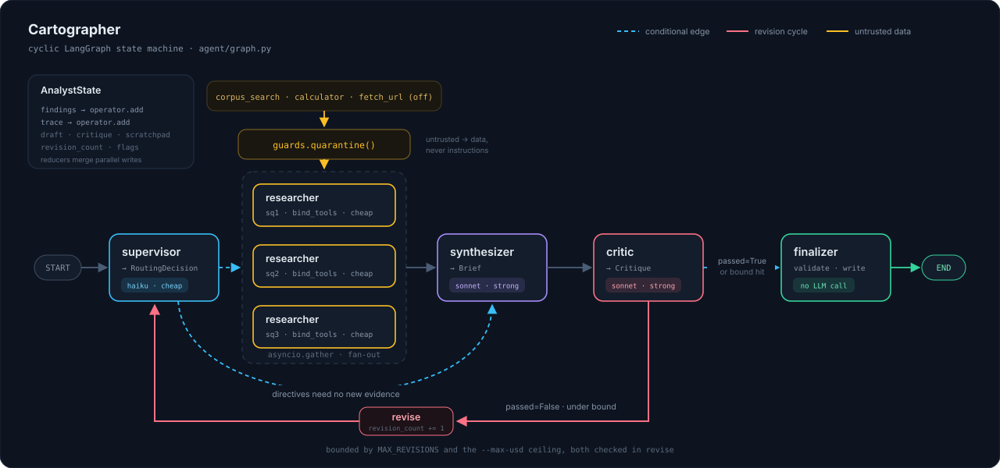
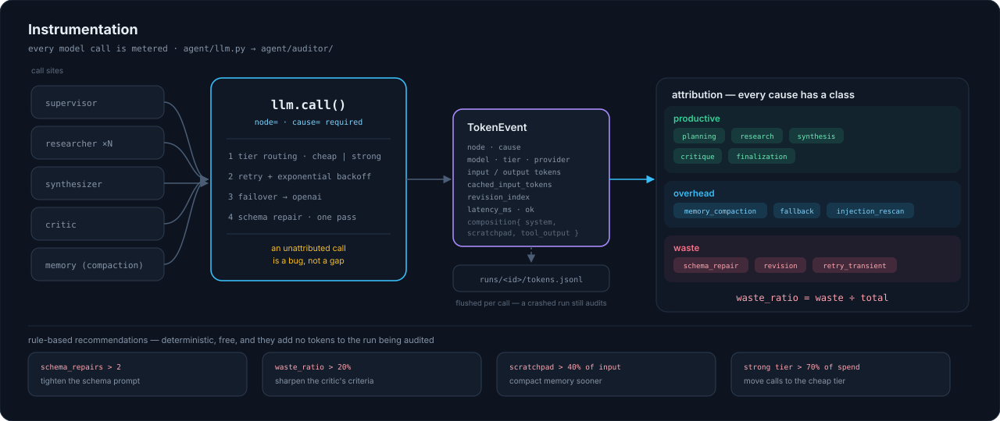

<div align="center">

# 🧭 Cartographer

**Maps a question into an evidenced brief — and shows you exactly what it cost to get there.**

[](https://github.com/bhavik168/Cartograph/actions/workflows/ci.yml)

[](https://github.com/astral-sh/ruff)


</div>

A cyclic **LangGraph** state machine that runs a supervisor → specialist → critic
loop which can send work *back* for revision — with Pydantic-validated structured
output on every hop, real tool calling, persistent state, cross-provider failover,
and a **token auditor** that attributes every single model call to a cause and
tells you which of your tokens were wasted.

Bring your own key, run it locally, read the report it writes.

<div align="center">

|  | |
|---|---|
| 🔁 **Cyclic graph** | the critic can route a failed draft back for revision — bounded, never infinite |
| 🧬 **Schema-first** | every LLM call returns a validated Pydantic model, with a repair pass when it doesn't |
| 🧮 **Token auditor** | per-node, per-cause, per-revision spend, and a **waste ratio** you can act on |
| 🛡️ **Quarantined tools** | untrusted output is labelled, flagged and capped before it reaches a prompt |
| 🔀 **Failover** | Anthropic primary, OpenAI fallback — exercised in tests, not just written |
| 🧪 **Offline tests** | the whole graph runs in CI against a stubbed LLM: no key, no network, no cost |

</div>

---

## Quick start

```bash
pip install -r requirements.txt
cp .env.example .env          # set ANTHROPIC_API_KEY
cp your-docs/*.md corpus/     # 5-15 plain-text documents
python cli.py ask "what does our corpus say about Q3 retention?"
```

One command produces one run directory:

```
runs/20260815T142201Z/
├── brief.json     the artifact: claims, evidence, confidence, limitations
├── trace.jsonl    one span per node execution
├── tokens.jsonl   one TokenEvent per LLM call, streamed as it happens
├── audit.json     machine-readable audit
└── audit.md       "where did the tokens go, and which were wasted?"
```

> [!TIP]
> Read `audit.md` first. It tells you what the run actually did, not what it was
> supposed to do.

---

## Architecture

<div align="center">
  
</div>

**The cycle is the point.** The critic scores the draft against named criteria —
grounding, coverage, specificity, calibration — and on failure routes back to the
supervisor with targeted directives rather than returning a bad brief. Two things
bound it: `MAX_REVISIONS`, and an optional `--max-usd` ceiling checked between
nodes. Either bound finalizes anyway and stamps the reason into the brief's
`limitations` — honest degradation instead of an infinite loop or a silent pass.

### Concepts worth naming

**Reducers.** `AnalystState.findings` and `.trace` are
`Annotated[list[...], operator.add]`. That reducer is what lets concurrently
running researcher branches write to the same state key without clobbering each
other — LangGraph merges each branch's partial update by calling the reducer
instead of overwriting. It's a LangGraph-specific idea, and it's why fan-out works
at all.

**Every LLM call goes through one function.** `LLMClient.call()` is the only place
a model is invoked, and `node` and `cause` are *required* keyword arguments. An
unattributed call is a bug, not a gap in the report.

**Tier routing is the cost story.** Cheap (Haiku) for routing and extraction,
strong (Sonnet) for synthesis and critique. The audit's *tier efficiency* section
tells you when you got that split wrong.

**Schema repair.** If a response fails Pydantic validation, the error text is fed
back once — *"fix exactly these fields"* — and the repair call is metered
separately as **waste**. Tighten the schema prompt and that number drops.

**Quarantine.** Every tool result passes through `guards.quarantine()` before it
can reach a prompt: wrapped in a labelled untrusted block, injection patterns
flagged inline rather than silently deleted, hard cap on length. There is no path
from a tool to the model that skips it.

### Where to look

| Concept | File |
|---|---|
| Graph wiring, conditional edges, the bounded cycle | [`agent/graph.py`](agent/graph.py) |
| State + reducers | [`agent/state.py`](agent/state.py) |
| Every Pydantic model | [`agent/schemas.py`](agent/schemas.py) |
| Provider routing, retry, failover, repair, metering | [`agent/llm.py`](agent/llm.py) |
| Injection quarantine and context caps | [`agent/guards.py`](agent/guards.py) |
| Checkpointer + scratchpad compaction | [`agent/memory.py`](agent/memory.py) |
| Nodes | [`agent/nodes/`](agent/nodes) |
| Tools — BM25, calculator, fetch | [`agent/tools/`](agent/tools) |
| Meter, attribution, pricing, report | [`agent/auditor/`](agent/auditor) |

---

## The Token Auditor

Most projects print a total token count. That's a number, not an insight. The
auditor answers *where did the tokens go, and which of them were wasted?*

<div align="center">
  
</div>

Every call carries a **cause**, and every cause has a class:

| Cause | Meaning | Class |
|---|---|:--|
| `planning` | supervisor routing decisions | 🟢 productive |
| `research` | specialist tool-calling turns | 🟢 productive |
| `synthesis` | drafting the brief | 🟢 productive |
| `critique` | critic scoring the draft | 🟢 productive |
| `finalization` | last validation pass | 🟢 productive |
| `memory_compaction` | scratchpad summarization | 🔵 overhead |
| `fallback` | tokens spent on the failover provider | 🔵 overhead |
| `injection_rescan` | re-processing after a quarantine flag | 🔵 overhead |
| `schema_repair` | retry after a Pydantic `ValidationError` | 🔴 **waste** |
| `revision` | any call made during a critic-driven revision pass | 🔴 **waste** |
| `retry_transient` | rate-limit / 5xx retries | 🔴 **waste** |

> [!IMPORTANT]
> **Waste ratio = `waste_tokens / total_tokens`** — tokens that produced no new
> information. It's the headline metric because it is fully deterministic (the
> auditor counts tokens, it does not judge text) and directly actionable.

### What `audit.md` looks like

Shape of the generated report. The placeholders are literal: **no numbers ship in
this repo** — yours come from your own runs.

```markdown
# Token Audit — run 2026-08-15T14:22:01Z
Question: "..."
Outcome: passed critic on revision 1 of max 2

## Totals
total_tokens  [RECORD REAL RESULT]   input / output split
est_cost_usd  [RECORD REAL RESULT]   (per pricing.py — verify rates)
wall_clock  ...s    llm_calls  N    schema_repairs  N

## Where the tokens went — by node        (sorted desc: biggest consumer first)
| node | calls | input | output | % of total | est_usd |

## Why the tokens were spent — by cause
| cause | tokens | % | class |
>>> WASTE RATIO: X%   (schema_repair + retry_transient + revision)

## What filled the context
system / scratchpad / tool_output / findings / schema_instructions

## Cost of the revision loop     first pass vs revision 1 vs revision 2
## Tier efficiency               cheap share of calls vs share of spend
## Recommendations               rule-based, not LLM-generated
```

Its recommendations are **rule-based, not LLM-generated** — deterministic, free,
unit-testable, and they add no tokens to the very run being audited.

### Pricing

`agent/auditor/pricing.py` is a plain dict of
`{model: (in_usd_per_1k, out_usd_per_1k)}`.

> [!WARNING]
> **Prices change, and this repo does not claim authoritative rates.** Every USD
> figure is only as correct as the table you maintain. A model with no entry is
> priced at zero and named in the report, so the gap is obvious rather than silent.

---

## Commands

| Command | What it does |
|---|---|
| `python cli.py ask "question"` | run the graph, write a run directory |
| `python cli.py ask "..." --max-usd 0.50` | halt and finalize honestly at a budget ceiling |
| `python cli.py ask "..." --max-revisions 1` | tighter loop bound |
| `python cli.py ask "..." --thread-id abc` | resume a halted run from its checkpoint |
| `python cli.py audit <run_id>` | re-render a past run's audit |
| `python cli.py audit <run_id> --json` | machine-readable audit to stdout |
| `python cli.py runs` | list runs with cost and waste ratio |
| `pytest -q` | full suite, no API key needed |

---

## Tests run without an API key

`LLMClient` never constructs a model itself; it calls an injected `model_factory`.
That one seam makes the whole orchestration layer testable offline — CI drives the
**real graph** with canned Pydantic objects and asserts:

- ✅ a failing critique routes back and increments the revision counter
- ✅ exceeding `MAX_REVISIONS` finalizes with honest limitations
- ✅ parallel findings accumulate through the reducer
- ✅ a `Claim` with zero evidence is rejected, and the repair path fires exactly once
- ✅ poisoned tool output is flagged and capped, not silently dropped
- ✅ transient errors retry, then fail over to OpenAI attributed as `fallback`
- ✅ auditor arithmetic — totals, per-cause aggregation, waste ratio, every
  recommendation threshold, and a zero-event run that must not divide by zero

CI runs exactly these. No key, no network, no cost. Live runs stay local.

---

## Honesty caveats

> [!NOTE]
> These are load-bearing, not boilerplate. Read them before believing any output.

1. **No results ship in this repo.** Every number in `audit.md`, `trace.jsonl` and
   `brief.json` comes from your own runs. Nothing is pre-computed.
2. **The critic is an LLM judging an LLM** from the same family, so it is probably
   lenient about failure modes it shares with the writer. A brief that passes has
   *passed the critic* — it has not been verified true. The finalizer stamps this
   into every brief's `limitations`. The one grounding check that isn't an LLM's
   opinion is deterministic: a claim citing a source no researcher actually
   retrieved is dropped and demoted to an open question.
3. **Small corpus, no benchmark.** This demonstrates architecture, not accuracy.
   There is no retrieval quality metric here and none is claimed.
4. **Injection defense is a mitigation, not a guarantee.** Known patterns are
   flagged and output is bounded. A novel injection can still get through.
5. **Cost figures are estimates** from a hand-maintained price table, computed from
   provider-reported usage. Treat them as a relative signal, not a bill.

---

## Try to break it

The interesting runs are the ones that go wrong on purpose:

| Try this | Expect |
|---|---|
| Ask something the corpus only partly supports | critic sends it back; revision counter increments; audit prices the revision as avoidable |
| Temporarily tighten a Pydantic constraint | the repair path fires and shows up as **waste** |
| Unset `ANTHROPIC_API_KEY`, keep `OPENAI_API_KEY` | run completes on the fallback path; those tokens attributed to `fallback` |
| Set `--max-usd` below your typical run cost | cycle halts, finalizes with `limitations: ["Halted at budget ceiling: ..."]` |

Then act on a recommendation and run it again. That before/after — *waste ratio
X% → Y%, cost per run A → B* — is the whole point, and unlike a quality metric it
is fully deterministic to measure.

---

<details>
<summary><b>Repo layout</b></summary>

```
agent/
├── schemas.py       every Pydantic model — state, agent outputs, telemetry
├── state.py         the graph state TypedDict and its reducers
├── graph.py         StateGraph wiring, conditional edges, the bounded cycle
├── runtime.py       per-run context: llm, meter, run dir, trace writer
├── llm.py           provider routing, retry, failover, repair, metering
├── memory.py        SQLite checkpointer + scratchpad compaction
├── guards.py        injection quarantine + context caps
├── nodes/
│   ├── supervisor.py    plans + routes; picks the specialist set
│   ├── researcher.py    tool-calling specialist, async fan-out
│   ├── synthesizer.py   merges findings into a draft Brief
│   ├── critic.py        scores the draft; emits revision directives
│   └── finalizer.py     last validation pass, writes the artifact
├── tools/
│   ├── corpus_search.py BM25 over corpus/ (no vector DB needed)
│   ├── calculator.py    AST-walked arithmetic, no eval
│   └── fetch_url.py     optional, off by default, SSRF-guarded
└── auditor/
    ├── meter.py         TokenEvent capture + budget ceiling
    ├── attribute.py     cause taxonomy, waste ratio, recommendations
    ├── pricing.py       per-model $/token table (user-editable)
    └── report.py        renders audit.md + audit.json

cli.py               ask / audit / runs
docs/                architecture and instrumentation diagrams
tests/               all offline, all stubbed
corpus/              your documents (gitignored)
runs/                your run artifacts (gitignored)
```

</details>

<details>
<summary><b>Environment</b></summary>

```bash
ANTHROPIC_API_KEY=              # primary
OPENAI_API_KEY=                 # optional fallback

# optional overrides
CARTOGRAPHER_CHEAP_MODEL=claude-haiku-4-5-20251001
CARTOGRAPHER_STRONG_MODEL=claude-sonnet-4-5-20250929
CARTOGRAPHER_OPENAI_CHEAP_MODEL=gpt-4o-mini
CARTOGRAPHER_OPENAI_STRONG_MODEL=gpt-4o
CARTOGRAPHER_ENABLE_FETCH_URL=0 # network access for the fetch tool
```

</details>
